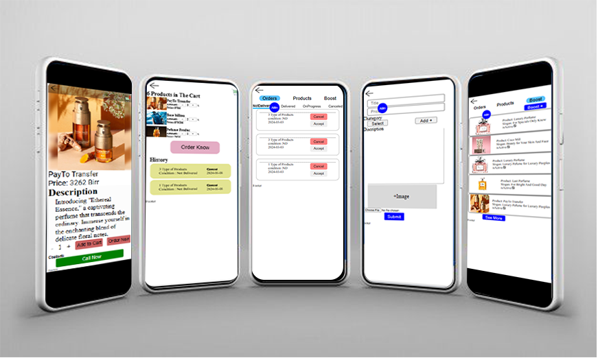

Presenting a cutting-edge e-commerce platform tailored for a cosmetics emporium, leveraging a sophisticated tech stack comprising 
    _Django, 
    _Django Rest Framework, 
    _React, 
    _React Redux, and
    _ React Router. 
    

Our meticulously crafted website boasts a seamless and responsive design, ensuring an optimal user experience across all devices. Explore a myriad of functionalities, including a streamlined shopping experience with the ability to effortlessly add products to the cart, place orders, and access comprehensive order history.

Designed with the discerning user in mind, our mobile-responsive admin panel empowers the owner with advanced capabilities, facilitating efficient management of the entire online store. The integration of Django and Django Rest Framework ensures robust backend support, while the frontend, developed with React and enhanced by React Redux, promises a dynamic and interactive interface.